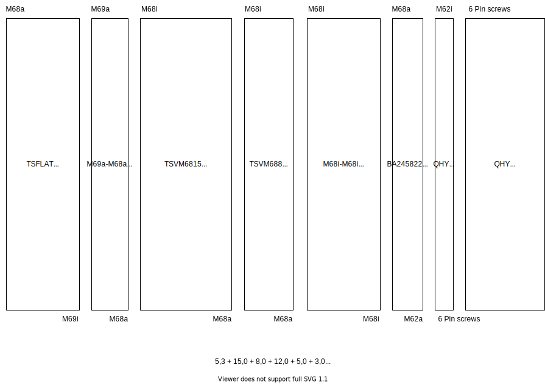

Backfocus calculation for QHY600 and TSFLAT2.5
==============================================
My setup is on the telescope side a flattener TSFLAT2.5 from teleskop-service.
This flattener need for my focal length of 714 mm a backfocus of 91mm. The image
train consist of a QHY600PH c-mos camera, a QHYCFW3-XL filter wheel, the necessary
adapters, a Gerd Neumann tilt adapter. To define the optical length of the image
train here are the drawings and calculations.

QHY600
------
Drawing at: https://www.qhyccd.com/uploadfile/2020/1103/20201103052311996.jpg

.. image:: image/qhy600ph.png
    :align: center
    :scale: 71%

It has a distance from sensor to the support surface of the dovetail from 17.5mm.
Unfortunately QHY does not tell how thick the protection glass is. So you could
guess and choose if you would like to take the optical reduction of the glass into
acount.

QHYCFW3-XL
----------
Drawing at https://www.qhyccd.com/wp-content/uploads/2021042888-scaled.jpg

.. image:: image/qhycfw3-xl.png
    :align: center
    :scale: 71%

The filter wheel has a thickness of 21.5mm. The dove tail support surface is
12mm - 9mm = 3mm above the surface of the filter wheel which leads to a total
optical length of 21.5mm + 3mm = 24.5mm.

Filter
------
When using glass filters, they reduce the resulting optical length by 1/3 of their
thickness due to the different refraction of the glass. My filter are 3mm thick,
so you have to the optical length is reduced by 1mm.

Calculation
-----------
The measurement starts at end of flattener.
camera + filter wheel - filter

17.5 + 24.5 - 1 = 41

So my optical length for the relevant image train is 41mm. With a needed backfocus
of 91mm I need adapters to manage the interface filterwheel -> TSFLAT2.5 in a
length of overall 91 mm - 41 mm = 50 mm optical length.

In total we get 48,3 mm. We could add a 1mm space ring which does 49,3 mm a the end.
