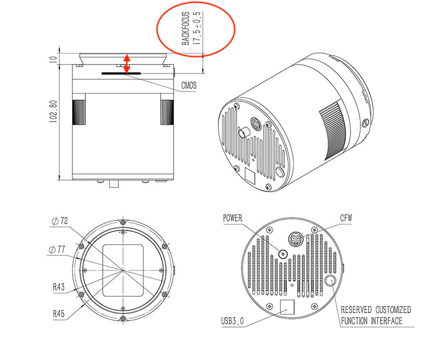
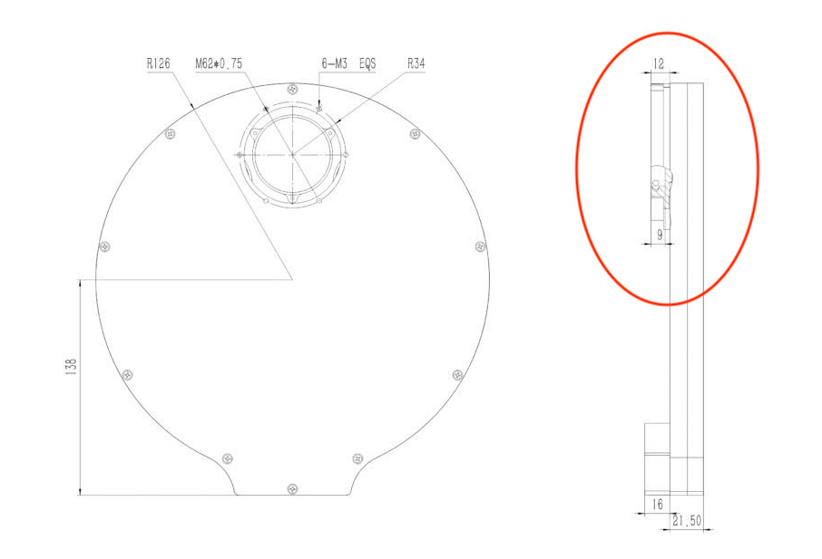

Backfocus calculation for QSI690 and TSRED379
=============================================
My setup is on the telescope side a reducer TRED379 from teleskop-service. This
reducer needs for my focal length of 714mm a backfocus of 56mm. The image train
consist of a QHY600PH c-mos camera, a QHYCFW3-XL filter wheel, a QHYOAG-L on axis
guider and the necessary adapter (s). To define the optical length of the image
train here are the drawings and calculations.

QHY600
------
Drawing at: https://www.qhyccd.com/uploadfile/2020/1103/20201103052311996.jpg

It has a distance from sensor to the support surface of the dovetail from 17.5mm.
Unfortunately QHY does not tell how thick the protection glass is. So you could
guess and choose if you would like to take the optical reduction of the glass into
acount.

QHYCFW3-XL
----------
Drawing at https://www.qhyccd.com/wp-content/uploads/2021042888-scaled.jpg

The filter wheel has a thickness of 21.5mm. The dove tail support surface is
12mm - 9mm = 3mm above the surface of the filter wheel which leads to a total
optical length of 21.5mm + 3mm = 24.5mm.

QHYOAG-L
--------
Is quite simple as this on axis guider has a defined optical length of 10mm.

Filter
------
When using glass filters, they reduce the resulting optical length by 1/3 of their
thickness due to the different refraction of the glass. My filter are 3mm thick,
so you have to the optical length is reduced by 1mm.

Calculation
-----------
camera + filter wheel + oag - filter

17.5 + 24.5 + 10 - 1 = 51

So my optical length for the image train is 51mm. With a needed backfocus of 56mm
I need an adapter to manage the interface oag -> TSRED379 within 5mm. This parts
are not commonly available, but could be custom made. I choose a bolted (62mm
diameter screw circle) on the filter wheel to screwed M48x0.75mm on the reducer.

Remarks
-------

.. epigraph::   Remarks about tuning the backfocus:

                There are a number of variables that come into play when using
                refractors with CCD cameras. The large chips and small pixel size
                in today’s cameras make things even more challenging.
                Field flatteners are designed with the goal to exactly counter
                the inherent inward curvature and bring the star size down by a
                factor of about 50 (down to about 5-6 microns), and make it
                perfectly round. By and large that's what our field flatteners
                are designed to do, but this exact cancellation is dependent on
                the exact focal length of the scope and the exact placement of the
                flattener optics with respect to the chip.
                A small difference in the scope focal length from ideal can
                require a different chip to flattener distance. If the distance is
                too short or too long, you will get imperfect cancellation of the
                field curvature/astigmatism, and you will get slightly larger
                stars and small amount of oval astigmatism and or coma. Therefore,
                to get better star shape for large chips, the chip to flattener
                distance will need to be modified somewhat (perhaps a few mm
                inward or outward). The first thing would be to determine the
                shape of the left over field curvature and whether it is inward or
                outward (under corrected or overcorrected). There is a very easy
                way to determine that by simply measuring the perfect focus point
                of the corner stars versus the perfect focus point of the stars in
                the center of the chip. If you have simple field curvature, then
                all the corner stars will have the same focus points where they
                are smallest, but if your camera has any tilt, then the field
                flattener will not correct all the corners the same.

                (Roland Christensen)

Finetuning
----------
First determine the exact focus point of stars near the center. Then choose a
corner star and focus on it. If you have to move the focuser forward (toward the
objective lens), then your field curvature is under corrected and you will need to
move the chip back a few mm more.

If you have to move the focuser outward to get sharp corner stars, then your
flattener to chip distance is too great and you will have to reduce the distance
between flattener and chip.

In either case, just looking at an image with defocused stars in the corners one
cannot determine whether the field is inward or outward curving (under or over
corrected). Inspection programs like CCD inspector also cannot tell which way the
field is curved, but by noting the focus difference and direction between center
and corner stars, you can tell which way you need to change the spacing.

