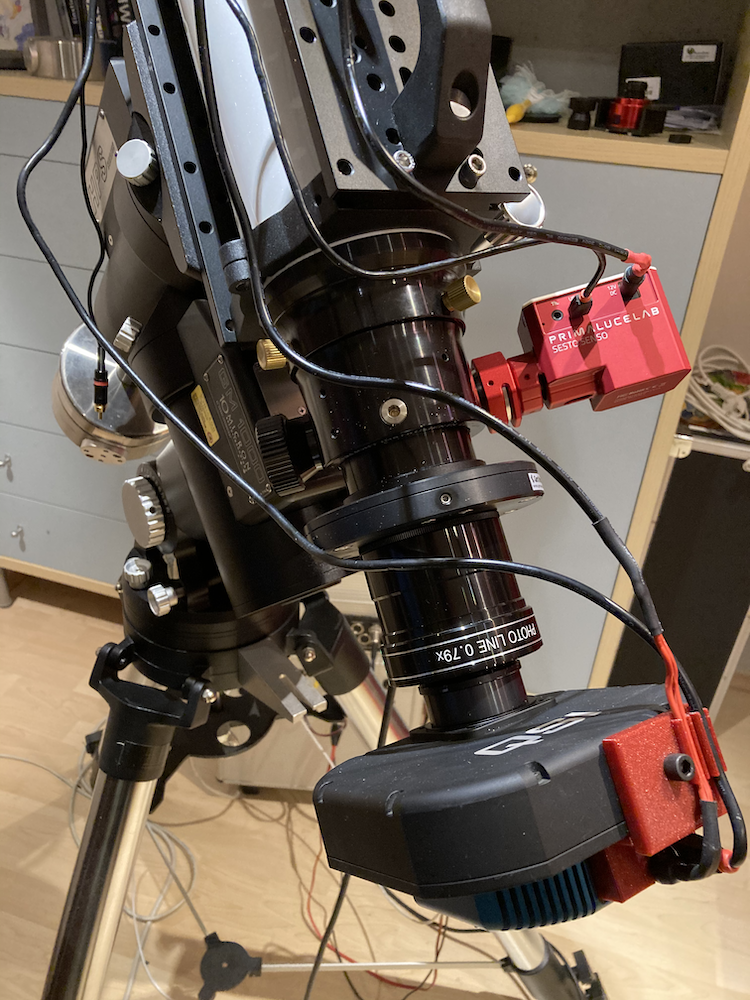
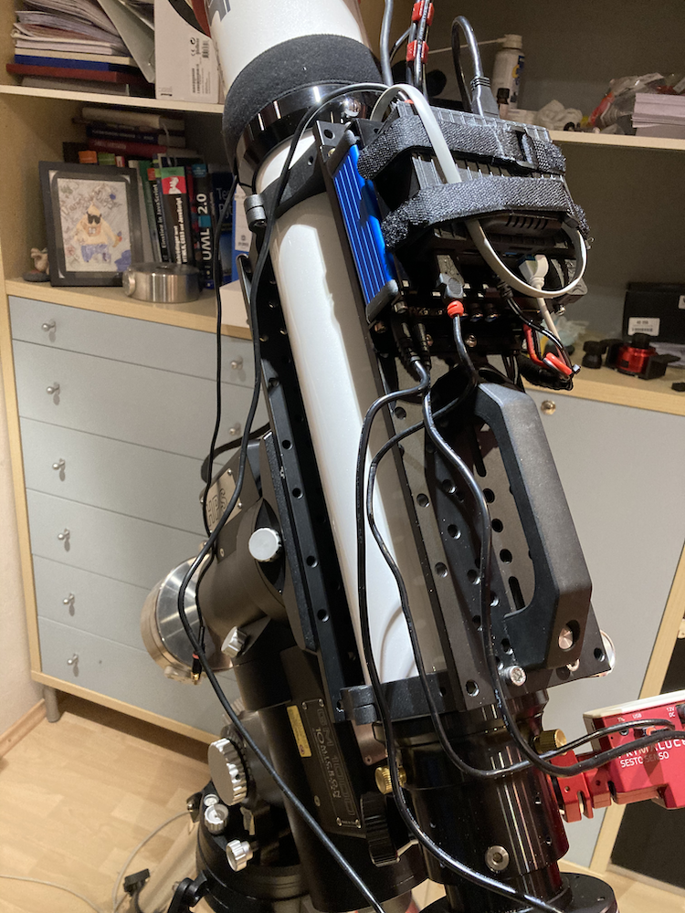
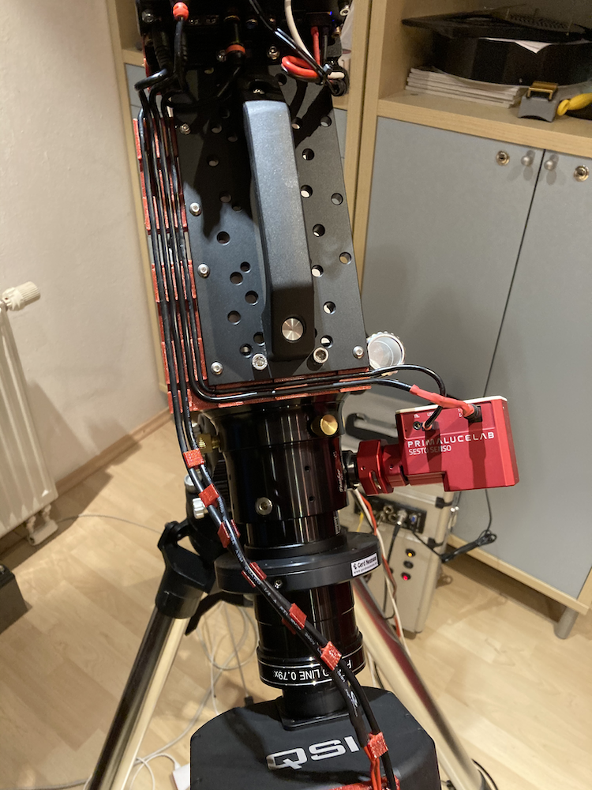
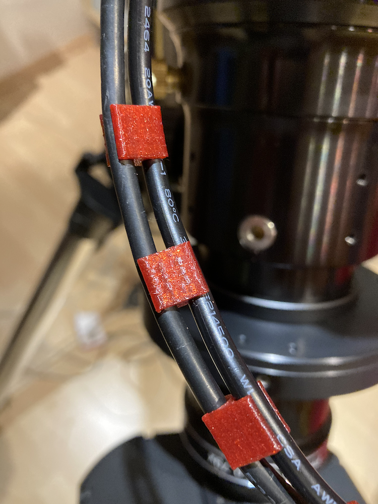
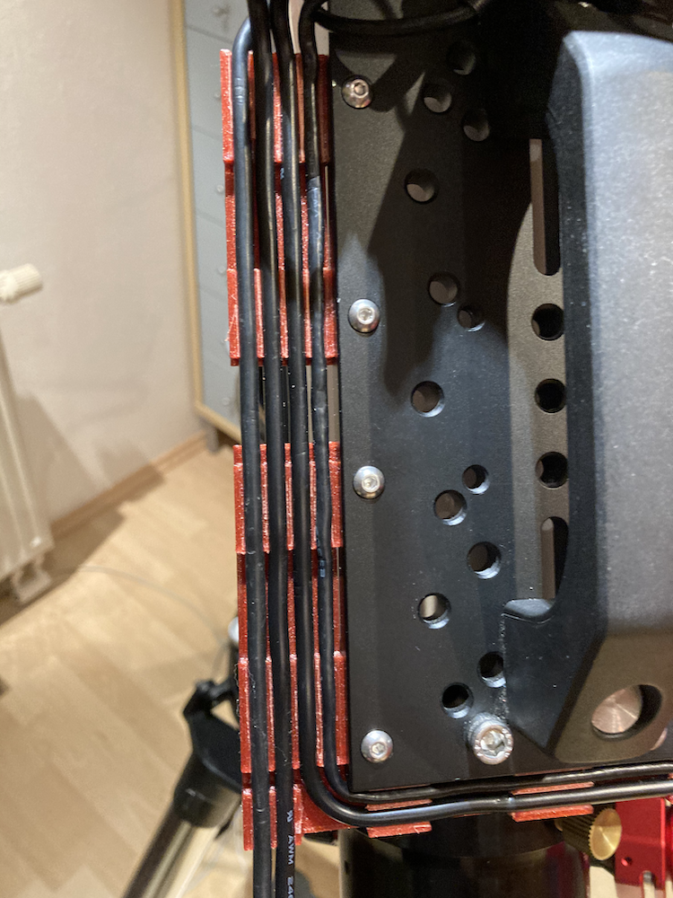
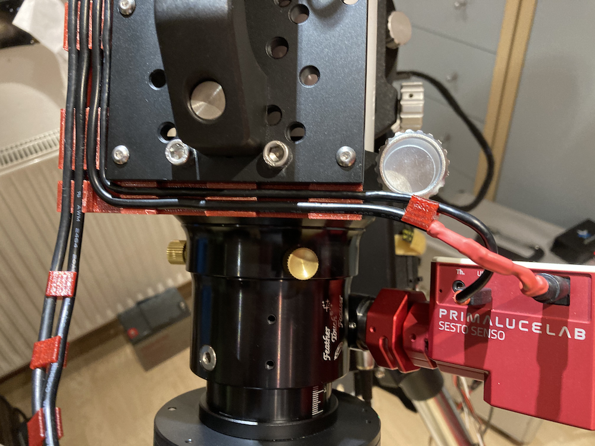
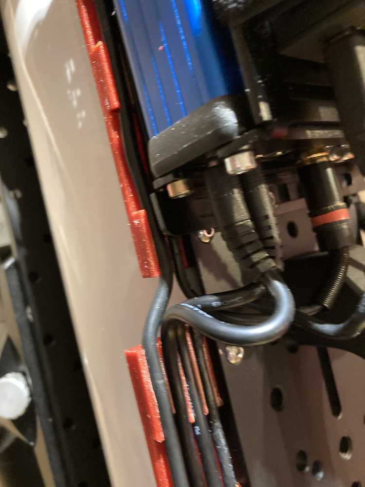
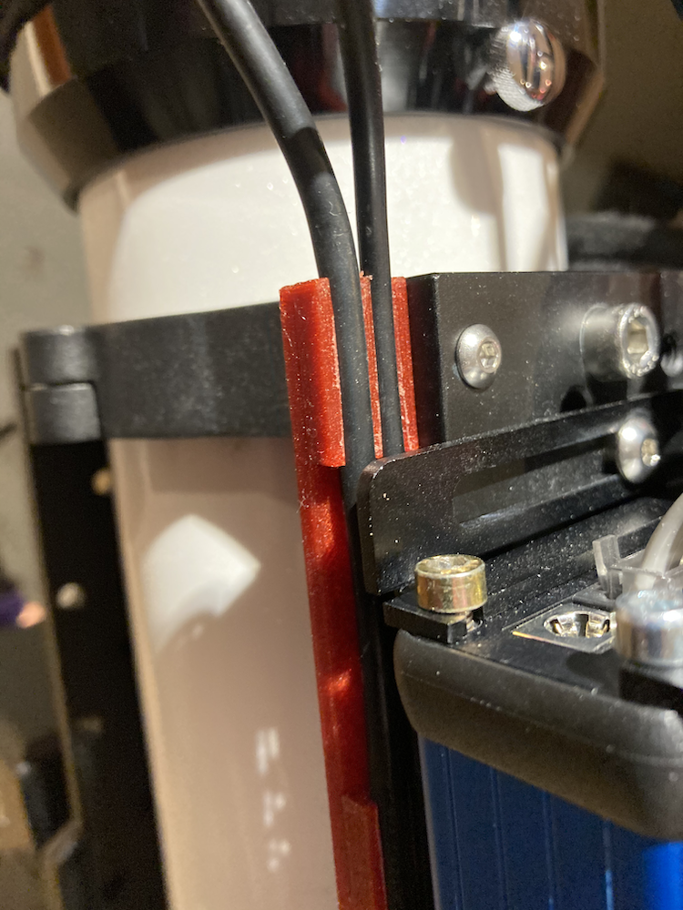

Cable Management On Rig
=======================
As I do not like cable ties to be spread overall, I started to get a clean cable
management on the rig itself. For this reason I started to print cable channels,
which are attached to the dovetails. The advantage is if you need to remove a wire
you just could do it without any tools.

So I started removing all the cable ties from my rig. PartI.

Part II.

And the printed channels attached to the dovetail.

I also did some clips to attach two cable to each other.

Detailed view on the left side where the connections for focuser and ccd (USB and
power) are alinged to each other.

The two lines which direct to the focuser on the right side.

Passing the Pegasus UPB below with Power for Dew and the USB for the camera (which
is attache to the front of the Mini PC (USB3). Part I

Part II

